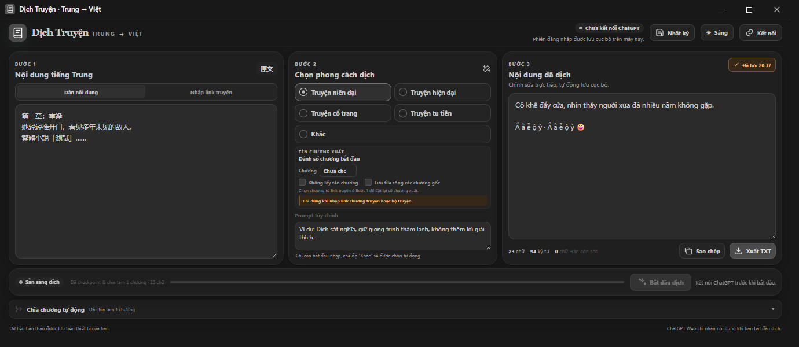

<div align="center">
  
  <h1>Tool Dịch Truyện · Trung → Việt</h1>
  <p><strong>Ứng dụng Windows hỗ trợ tải truyện, dịch bằng ChatGPT, Kimi hoặc DeepSeek Web, kiểm tra kết quả, khôi phục checkpoint và xuất bản dịch theo chương.</strong></p>
  <p>
    
    
    
    
    
  </p>
</div>



> [!IMPORTANT]
> Tool điều khiển giao diện ChatGPT, Kimi hoặc DeepSeek Web trong trình duyệt do ứng dụng mở; không gọi API dịch và không vượt CAPTCHA, đăng nhập hay giới hạn tài khoản. Người dùng cần tự đăng nhập và chịu trách nhiệm kiểm tra bản dịch trước khi sử dụng.

## Tổng quan

Tool Dịch Truyện gom toàn bộ quy trình dịch truyện dài vào một ứng dụng desktop: nhập văn bản hoặc link truyện, chọn phong cách, dịch có checkpoint, kiểm tra phản hồi, tiếp tục sau sự cố, chia chương và xuất TXT. Bốn prompt mặc định gồm **niên đại**, **hiện đại**, **cổ trang** và **tu tiên**; người dùng vẫn có thể nhập prompt riêng.

**Điều hướng:** [Tính năng](#tính-năng-chính) · [Cài đặt phát triển](#cài-đặt-và-chạy-phát-triển) · [Cách sử dụng](#cách-sử-dụng) · [Kiểm thử](#kiểm-thử) · [Đóng gói](#build-và-đóng-gói-windows) · [Bảo mật](SECURITY.md) · [Đóng góp](CONTRIBUTING.md)

## Tính năng chính

- Nhập trực tiếp văn bản tiếng Trung hoặc phân tích link truyện theo danh sách chương.
- Hỗ trợ các nguồn đã kiểm thử trong adapter: Huliwang, XSZJ/爱下电子书, TimoTXT, Qingrenyouxi, Xbanxia và Novel543.
- Ghép đủ các trang con của cùng một chương và loại bỏ footer/navigation đã nhận diện theo từng website.
- Chọn bốn prompt đóng gói sẵn: `Truyện niên đại`, `Truyện hiện đại`, `Truyện cổ trang`, `Truyện tu tiên`; hoặc dùng prompt `Khác`.
- Chọn nhóm cố định gồm một, hai hoặc cả ba chatbot ChatGPT/Kimi/DeepSeek; mặc định dùng cả ba.
- Lưu checkpoint, nhóm chatbot, nhật ký hoạt động và tiếp tục đúng đoạn lỗi sau khi app/trình duyệt bị gián đoạn.
- Retry có kiểm tra chữ Hán còn sót, lặp nội dung, tiêu đề và phản hồi an toàn; tự chuyển trong nhóm chatbot đã chọn theo loại lỗi.
- Khi tiến trình lỗi, cho phép dùng một chatbot ngoài nhóm để cứu đúng một lượt; sau thành công hoặc thất bại đều quay lại nhóm cố định mà không lặp bot cứu.
- Chia chương, tự nhận diện số chương, đánh lại số, tùy chọn bỏ tên chương và chỉnh riêng nội dung preview.
- Xuất đầy đủ TXT chương lẻ, bản dịch gốc chưa chia, file tổng bản dịch và file tổng chương nguồn với cả dải số cũ/mới.
- Giao diện sáng/tối, zoom thích nghi theo vùng làm việc Windows và nhật ký tiến trình dễ đọc.
- Tùy chọn dùng Gemini để gợi ý tên chương.

### Nhập Huliwang bằng trình duyệt mặc định

Huliwang có thể từ chối trình duyệt tự động dù không hiện CAPTCHA. Bản đầy đủ kèm thư mục
`Huli Browser Helper` nằm ngay cạnh `ToolDichTruyen.exe`, cho phép tool đọc trang trong chính Cốc Cốc/Chrome/Edge và profile bạn dùng hằng
ngày. Tiện ích không đọc cookie, lịch sử hay mật khẩu, không dùng Playwright/CDP và không tự bấm
CAPTCHA hoặc Turnstile.

1. Khi Huliwang báo Cloudflare trong tab `Nhập link truyện`, bấm `Mở thư mục tiện ích`. Thư mục được mở là
   `Huli Browser Helper`, ngay cạnh file `ToolDichTruyen.exe`.
2. Mở `README-VI.md` trong thư mục đó và tải tiện ích đã giải nén một lần vào trình duyệt mặc định: `coccoc://extensions`,
   `chrome://extensions` hoặc `edge://extensions`.
3. Quay lại tool, bấm `Kết nối trình duyệt mặc định`. Trang ghép nối cục bộ `127.0.0.1` mở trong
   đúng profile thường; kết nối xong tool tự phân tích lại link.
4. Giữ tab Huliwang mở trong lúc tải chương. Nếu website hiện kiểm tra tương tác, hoàn tất bằng tay;
   tiện ích chỉ đọc lại DOM, không reload liên tục và không tự thao tác bước xác minh.

Chrome/Edge trên Windows không cho ứng dụng portable tự cài tiện ích cục bộ một cách im lặng, nên
bước tải tiện ích đã giải nén cần được người dùng xác nhận một lần.

## Lưu ý quan trọng về chatbot Web

Tool điều khiển giao diện web của ChatGPT, Kimi và DeepSeek bằng trình duyệt, không gọi API dịch trực tiếp.

- Người dùng phải tự đăng nhập chatbot đã chọn trong cửa sổ trình duyệt được tool mở. Tool không tự điền, lưu hoặc vượt qua mật khẩu, CAPTCHA hay xác thực hai bước.
- Phiên đăng nhập được giữ trong một profile trình duyệt cục bộ dành riêng cho ứng dụng.
- Giao diện, thuộc tính DOM và luồng phản hồi của từng chatbot có thể thay đổi bất kỳ lúc nào. Khi đó automation hoặc selector có thể ngừng hoạt động và cần được cập nhật.
- A/B test giao diện, CAPTCHA, giới hạn tài khoản, giới hạn tần suất, lỗi mạng hoặc thay đổi chính sách dịch vụ có thể làm tác vụ thất bại.
- Hãy sử dụng tài khoản và nội dung phù hợp với điều khoản của dịch vụ liên quan.

## Yêu cầu

### Để chạy bản phát triển

- Windows 10/11.
- Node.js `>= 22`.
- `pnpm` tương thích với lockfile của dự án.
- Microsoft Edge hoặc Google Chrome đã cài trên máy.
- Tài khoản của ít nhất một chatbot ChatGPT, Kimi hoặc DeepSeek có thể đăng nhập bằng trình duyệt.

### Để dùng tính năng đặt tên chương

- Gemini API key từ Google AI Studio hoặc một nguồn cấu hình Gemini tương thích.
- Đây là tính năng tùy chọn; dịch và chia chương thông thường không phụ thuộc Gemini.

## Cài đặt và chạy phát triển

Yêu cầu Node.js 22+ và pnpm 11.16.0. Repository không chứa cookie, profile trình duyệt, draft, checkpoint, bản dịch hay khóa API. Không chép dữ liệu trong `%APPDATA%\tool-dich-truyen` vào source/GitHub.

Tại thư mục gốc dự án:

```powershell
pnpm install --frozen-lockfile
pnpm dev
```

Nếu lockfile đang được chủ động cập nhật trong quá trình phát triển, người duy trì có thể dùng `pnpm install`; trước khi phát hành nên quay lại quy trình cài đặt cố định bằng lockfile.

Để chạy bản build đã tạo trước đó:

```powershell
pnpm start
```

Lệnh `start` chỉ phù hợp sau khi output cần thiết đã tồn tại.

## Cách sử dụng

### 1. Chọn và kết nối chatbot

1. Chọn ChatGPT, Kimi AI hoặc DeepSeek AI trên thanh chatbot rồi bấm `Kết nối`.
2. Nếu trạng thái yêu cầu đăng nhập, đăng nhập thủ công trong cửa sổ trình duyệt vừa mở.
3. Hoàn tất CAPTCHA hoặc xác thực hai bước nếu dịch vụ yêu cầu.
4. Quay lại ứng dụng và bấm `Kiểm tra kết nối` nếu trạng thái chưa tự cập nhật.
5. Chọn nhóm chatbot được phép dùng cho tiến trình (mặc định cả ba) và chỉ bắt đầu dịch khi chatbot hiện tại đã kết nối.

Không mở đồng thời nhiều phiên Tool dịch truyện dùng chung profile trình duyệt.

### 2. Nhập nội dung và chọn prompt

1. Dán nội dung nguồn vào ô `Nội dung tiếng Trung`.
2. Chọn một trong năm chế độ:
   - `Truyện niên đại`: dùng prompt tại `resources/prompts/nien-dai.txt`.
   - `Truyện hiện đại`: dùng prompt tại `resources/prompts/hien-dai.txt`.
   - `Truyện cổ trang`: dùng prompt tại `resources/prompts/co-trang.txt`.
   - `Truyện tu tiên`: dùng prompt tại `resources/prompts/tu-tien.txt`.
   - `Khác`: dùng prompt người dùng nhập.
3. Khi bắt đầu gõ vào ô prompt tùy chỉnh, giao diện tự chọn chế độ `Khác`.

Bốn prompt mặc định được đọc dưới dạng UTF-8 khi ứng dụng chạy và được đóng kèm vào `resources` khi package.

### 3. Dịch và xử lý lỗi

1. Bấm `Bắt đầu dịch`.
2. Theo dõi số đoạn đã hoàn tất và trạng thái hiện tại.
3. Có thể `Tạm dừng`, `Tiếp tục` hoặc `Hủy` tác vụ.
4. Sau mỗi đoạn hợp lệ, checkpoint được lưu ngay, phần đã dịch được ghép vào ô `Nội dung đã dịch` và preview chia chương cập nhật song song trong worker riêng.
5. Khi một đoạn không vượt qua kiểm tra sau số lần thử cho phép, dùng nút `Tiếp tục từ đoạn lỗi` của đúng đoạn đó; các đoạn đã hoàn tất vẫn được giữ nguyên.
6. Kết quả hợp lệ được ghép vào ô `Nội dung đã dịch`; người dùng có thể sửa trực tiếp trước khi xuất.

Trong lúc tiến trình chạy, nhóm chatbot được khóa. Khi tiến trình lỗi, cả ba lựa chọn chatbot được mở để người dùng chọn bot cứu đoạn. Bot ngoài nhóm chỉ chạy một lượt cho đúng đoạn lỗi, không tự retry, rồi tiến trình quay về nhóm chatbot ban đầu.

Việc sửa nội dung nguồn sau khi tác vụ đã bắt đầu không thay đổi snapshot nguồn của tác vụ đang chạy.

### 4. Kiểm tra và xuất bản dịch

- Chỉ số `chữ Hán còn sót` giúp phát hiện nhanh ký tự Trung chưa được dịch.
- Bản nháp nguồn, output, prompt tùy chỉnh và cấu hình chia chương được tự động lưu cục bộ.
- Dùng `Sao chép` để đưa bản dịch vào clipboard hoặc `Xuất TXT` để chọn nơi lưu tệp.
- Luôn đọc lại bản dịch trước khi xuất bản hoặc sử dụng tiếp.

### 5. Chia chương

Phần `Chia chương tự động` nằm dưới ô bản dịch.

1. Chọn số chữ/chương; mặc định là `800` và 750 là ngưỡng ưu tiên khi có thể.
2. Nhập chương bắt đầu, tiền tố và hậu tố nếu cần.
3. Chọn ngôn ngữ dùng để đếm chữ.
4. Bật `Nhận diện tiêu đề có sẵn` nếu nội dung đã có các dòng như `Chương 12: ...`.
5. Bật `Tô đỏ chữ Hán` để kiểm tra ký tự còn sót; tắt chế độ này khi cần sửa nội dung preview.
6. Sửa tên hoặc nội dung từng chương trong preview, sau đó sao chép hoặc xuất TXT.

Preview chỉ cắt tại ranh giới đoạn xuống dòng, không cắt giữa từ, câu hoặc lời thoại. Một đoạn dài hơn mục tiêu được giữ nguyên; vì vậy số chữ/chương có thể vượt khoảng mục tiêu. Preview là dữ liệu biên tập riêng. Sửa preview không ghi đè ô `Nội dung đã dịch`; nếu output hoặc cấu hình chia thay đổi, preview có thể được tạo lại.

### 6. Đặt tên chương bằng Gemini

1. Trong thanh công cụ chia chương, bấm `Cấu hình Gemini`.
2. Nhập model và API key, rồi bấm `Lưu cấu hình`.
3. Bấm `Đặt tên bằng Gemini` sau khi đã có danh sách chương.
4. Kiểm tra và sửa các tên gợi ý trước khi xuất.

Ứng dụng chỉ gửi trích đoạn đầu của mỗi chương tới Gemini khi người dùng chủ động bấm đặt tên. API key được xử lý ở main process; trên Windows, ứng dụng cố gắng mã hóa khóa bằng cơ chế bảo mật hệ điều hành. Có thể dùng biến môi trường thay vì lưu khóa trong giao diện.

## Biến môi trường

| Biến | Mục đích |
|---|---|
| `CHATGPT_BROWSER_EXECUTABLE` | Đường dẫn tuyệt đối tới `msedge.exe` hoặc `chrome.exe` nếu ứng dụng không tự tìm thấy trình duyệt. |
| `GEMINI_API_KEY` | Gemini API key dùng cho đặt tên chương. |
| `GOOGLE_API_KEY` | Tên biến dự phòng cho Gemini API key. |
| `GEMINI_MODEL` | Model Gemini mặc định nếu chưa lưu model trong cài đặt. |
| `CHATGPT_BASE_URL` | Ghi đè URL ChatGPT cho môi trường kiểm thử/phát triển; không nên đổi trong sử dụng thông thường. |
| `TOOL_DICH_TRUYEN_USER_DATA` | Ghi đè thư mục dữ liệu người dùng cho test cô lập. |

Ví dụ chỉ định Chrome trong PowerShell cho phiên terminal hiện tại:

```powershell
$env:CHATGPT_BROWSER_EXECUTABLE = 'C:\Program Files\Google\Chrome\Application\chrome.exe'
pnpm dev
```

Không commit API key, profile trình duyệt, draft hoặc dữ liệu người dùng vào Git.

## Kiểm thử

### Kiểm tra kiểu TypeScript

```powershell
pnpm typecheck
```

Có thể chạy riêng từng phía:

```powershell
pnpm typecheck:node
pnpm typecheck:web
```

### Test tự động

```powershell
pnpm test
```

Các nhóm test hiện được tổ chức tại:

- `tests/unit`: parser, đếm/ngôn ngữ, chia chương, chunk nguồn, prompt và validator.
- `tests/integration`: persistence, prompt loader, Gemini service, ChatGPT adapter và runner dịch với dependency được kiểm soát/mocked.
- `tests/renderer`: component UI và cầu nối `window.storyTool` được mock.

Chạy coverage:

```powershell
pnpm test:coverage
```

Chạy Electron smoke test:

```powershell
pnpm test:e2e
```

Smoke test build ứng dụng, mở Electron với thư mục user-data tạm, kiểm tra preload bridge, nhập dữ liệu mẫu, thử UI chia chương và lưu screenshot vào `test-results`. Test này không xác minh đăng nhập hoặc dịch thật qua website chatbot.

Không ghi nhận lệnh nào là `pass` chỉ dựa vào tài liệu này. Điền môi trường, kết quả, artifact và lỗi thực tế vào [docs/TEST_REPORT.md](docs/TEST_REPORT.md).

## Build và đóng gói Windows

Build TypeScript và Electron bundles:

```powershell
pnpm build
```

Nếu thành công, output trung gian được tạo trong `out`.

Đóng gói NSIS installer và portable executable:

```powershell
pnpm package:win
```

CI chỉ chạy typecheck, test không-live và production build. Các phép thử live cần phiên đăng nhập và thao tác mạng phải được chạy thủ công trên profile kiểm thử riêng.

Theo cấu hình hiện tại, artifact dự kiến nằm trong `release`. Sau khi đóng gói phải kiểm tra thực tế cả installer và portable trên một máy Windows sạch trước khi phát hành. Không coi thư mục hoặc tên script cấu hình là bằng chứng package đã thành công.

## Cấu trúc dự án

```text
src/
├── core/        # Logic thuần: parser, splitter, validator, chunk và prompt
├── main/        # Electron main, ChatGPT browser automation, persistence, Gemini
├── preload/     # Cầu nối IPC window.storyTool
├── renderer/    # React UI
└── shared/      # Type dùng chung
resources/
├── prompts/     # Bốn prompt phong cách đóng kèm ứng dụng
└── huli-browser-helper/ # Tiện ích trình duyệt cho các nguồn cần profile thường
tests/
├── unit/
├── integration/
├── renderer/
└── e2e/
```

## Xử lý sự cố

### Không tìm thấy Edge hoặc Chrome

- Cài Microsoft Edge hoặc Google Chrome.
- Hoặc đặt `CHATGPT_BROWSER_EXECUTABLE` tới executable hợp lệ.
- Đóng những phiên Tool dịch truyện khác đang giữ profile trình duyệt rồi thử lại.

### Luôn hiện “Chờ đăng nhập ChatGPT”

- Hoàn tất đăng nhập trong cửa sổ trình duyệt do ứng dụng mở, không phải một cửa sổ trình duyệt khác.
- Xử lý CAPTCHA/2FA nếu có.
- Quay lại ứng dụng và bấm `Kiểm tra kết nối`.
- Kiểm tra mạng và thử mở trực tiếp `https://chatgpt.com/`.

### Đã đăng nhập nhưng tool không tìm thấy ô nhập

ChatGPT có thể vừa thay đổi DOM hoặc đang chạy một biến thể giao diện chưa được selector hỗ trợ. Ghi lại phiên bản ứng dụng, screenshot, URL/trạng thái nhìn thấy và mở issue để cập nhật `src/main/chatgpt/selectors.ts` cùng adapter. Không dùng selector quá rộng để “sửa nhanh” vì có thể gửi nội dung nhầm vị trí.

### Gemini báo chưa cấu hình hoặc lỗi khóa

- Kiểm tra API key/model trong phần `Cấu hình Gemini`.
- Hoặc đặt `GEMINI_API_KEY` trước khi khởi động ứng dụng.
- Xác minh quota và quyền dùng model của tài khoản Google.
- Dịch và chia chương vẫn dùng được khi bỏ qua chức năng Gemini.

### Bản dịch còn chữ Hán

- Xem đoạn lỗi tương ứng và dùng `Thử lại` nếu tác vụ đã đánh dấu lỗi.
- Nếu chỉnh thủ công, dùng bộ đếm và chế độ tô đỏ trong preview chia chương để kiểm tra lại.
- Bộ kiểm tra tự động không thay thế việc biên tập của con người.

## Dữ liệu và quyền riêng tư

- Draft, cấu hình và profile đăng nhập ChatGPT được lưu trong thư mục dữ liệu người dùng của ứng dụng trên máy.
- Nội dung nguồn được gửi tới website chatbot đang được chọn khi bắt đầu dịch.
- Trích đoạn chương được gửi tới Gemini chỉ khi dùng tính năng đặt tên AI.
- Tệp TXT chỉ được ghi tới vị trí người dùng chọn.
- Trước khi chia sẻ log hoặc screenshot, hãy xóa nội dung truyện, token, API key và thông tin tài khoản.

## Giấy phép

Dự án hiện khai báo `UNLICENSED` và dành cho sử dụng nội bộ/cục bộ cho đến khi có chính sách cấp phép khác.
